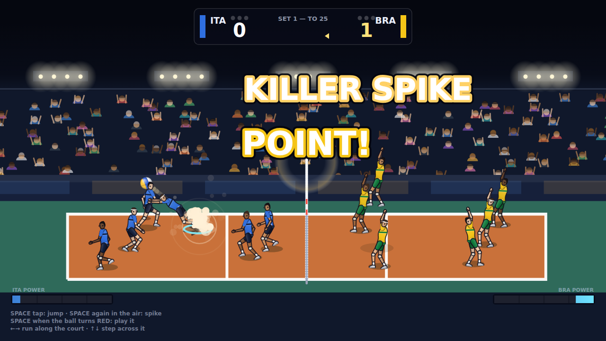

# Super Volley 90

Arcade 6-on-6 volleyball for macOS, built in the spirit of the early-90s coin-ops
— two buttons, a landing marker on the floor, and rallies that resolve in a few
loud seconds.

Everything here is original: the code, the procedural art, the synthesised
audio, the fictional teams. No assets or data from any existing game are used.



## Why it was built from scratch

The obvious starting point would have been an existing open-source volleyball
game, but none of the candidates fit:

| Project | Why not |
| --- | --- |
| [blobbyvolley2](https://github.com/danielknobe/blobbyvolley2) | The best-maintained option, but it is 1-on-1 blob physics under GPLv2 — the six-player rotations, blocking and landing-marker aiming that define this genre would mean replacing essentially all of it. |
| [DJWOMS/volleyball-game-godot](https://github.com/DJWOMS/volleyball-game-godot) | 3D, 14 commits, no licence file. |
| [Ahish9009/Volleyball](https://github.com/Ahish9009/Volleyball) | Python 2.7 / PyGame, single-player-vs-computer toy. |

So the simulation is new, and the *design* is what borrows from the era: the
landing marker, the semi-automatic contacts, the knockdown on a hard spike.

## Running it

```sh
npm install
npm run dev          # http://localhost:5173
```

### Building the macOS app

The game ships as a native `.app` via [Tauri](https://tauri.app) — a small Rust
shell around a WKWebView, so it is Metal-backed, Apple-Silicon-native and a few
megabytes rather than a bundled browser.

```sh
npm run app:dev      # run the native app with hot reload
npm run app:build    # produces src-tauri/target/release/bundle/{macos,dmg}
```

Both derive the macOS icon set from `src-tauri/icons/icon.png` first, so the
`.icns` the bundler needs is never missing — only the source PNG is in git.

Requires Rust (`rustup`) and the Xcode command line tools. Signing and
notarisation are not configured; add your identity to `tauri.conf.json` when you
need a distributable build.

**Or skip the toolchain entirely.** CI builds the app on a macOS runner for
every push; download `SuperVolley90-macos` from the run's artifacts. It contains
a `.dmg` and a `.tar.gz`, deliberately not a bare `.app`: GitHub re-zips
artifacts and drops Unix permission bits, which strips the executable flag off
the binary inside a `.app` and makes macOS report it as damaged. A disk image
and a tarball both carry their own permissions and survive intact.

### Signing and notarisation

The `macos-app` job has two modes, chosen by whether the repository has an
`APPLE_SIGNING_IDENTITY` secret.

**Without it** the app gets an ad-hoc signature. It runs, but nothing vouches
for who built it, so Gatekeeper blocks the first launch:

```sh
xattr -dr com.apple.quarantine "/Applications/Super Volley 90.app"
```

On macOS 15 and later the old right-click → Open bypass no longer works; use the
command above, or System Settings → Privacy & Security → **Open Anyway**.

**With a Developer ID** Tauri signs with hardened runtime, submits the build to
Apple's notary service and staples the ticket, so the app opens on a double
click like any other download. Add these repository secrets
(Settings → Secrets and variables → Actions):

| Secret | What it is | Where it comes from |
| --- | --- | --- |
| `APPLE_CERTIFICATE` | Developer ID Application certificate, as base64 | Export it from Keychain Access as `.p12`, then `base64 -i cert.p12 \| pbcopy` |
| `APPLE_CERTIFICATE_PASSWORD` | The password you set on that `.p12` | You choose it during the export |
| `APPLE_SIGNING_IDENTITY` | e.g. `Developer ID Application: Your Name (TEAMID)` | `security find-identity -v -p codesigning` |
| `APPLE_ID` | The Apple ID email on the developer account | — |
| `APPLE_PASSWORD` | An **app-specific** password, not your Apple ID password | [appleid.apple.com](https://appleid.apple.com) → Sign-In and Security → App-Specific Passwords |
| `APPLE_TEAM_ID` | 10-character team identifier | [developer.apple.com/account](https://developer.apple.com/account) → Membership |

The certificate must be a **Developer ID Application** certificate, not a Mac
App Store or Apple Development one — only that kind is accepted for software
distributed outside the App Store.

Notarisation adds a few minutes to the job. The workflow verifies the result
with `spctl --assess` and `stapler validate`, so a build that would still be
blocked on a user's machine fails in CI rather than in a download.

## Controls

| | Keyboard | Gamepad |
| --- | --- | --- |
| Move / aim | Arrows or WASD | Left stick / D-pad |
| Play the ball | Space or J | A / X |
| Jump | Shift or K | B / Y |
| Pause | Esc or P | Start |

Two buttons carry everything, exactly as the cabinets did:

- **Hold to charge.** A tap is a controlled pass or a tip; a full hold is a
  power swing or a jump serve. The meter above your player shows it.
- **The stick aims.** Where you are pushing when you make contact is where the
  ball goes — wide or line, short or deep.
- **Jump early.** Contact quality peaks at the top of your reach, so the spike
  that lands is the one where you took off before the set arrived.
- You steer one player; the ring on the floor shows who. Control hands over to
  whoever can realistically play the next ball, never mid-jump.

## Architecture

```
src/core/     simulation — no DOM, no rendering, fully deterministic
  rules.ts      court dimensions, scoring, tuning constants
  ball.ts       physics and the arc solvers
  player.ts     movement, jumping, diving, pose state
  contact.ts    what each kind of strike does to the ball
  team.ts       roster, rotation, formation anchors
  ai.ts         per-team job assignment and command generation
  world.ts      rally state machine, faults, scoring
src/render/   canvas presentation, projection, effects, HUD
src/game/     input, audio, menu, roster
src-tauri/    native macOS shell
tools/        headless runner, rally tracer, screenshot capture, icon generator
```

Two decisions shape the rest:

**The core never touches the DOM and never calls `Math.random()`.** Every random
draw comes from a seeded PRNG, so a match replays identically from its seed.
That is what makes `npm run sim` a usable balance tool and the tests meaningful.

**The simulation runs at a fixed 120 Hz, the renderer at display refresh.** On a
60 Hz panel that is two steps per frame; on a 120 Hz ProMotion display, one.
Physics and feel are identical either way, and there is no frame-rate-dependent
behaviour to chase.

## Tooling

```sh
npm test                            # unit and simulation tests
npm run typecheck
npm run sim -- --matches 6          # headless AI-vs-AI matches with statistics
npm run trace -- --seconds 20       # step-by-step rally trace
npm run shots -- shots/             # drive the real game in Chromium, capture frames
```

`npm run sim` is the balance harness. A healthy build looks roughly like this:

```
986 points, avg rally 6.5s, avg touches/rally 6.7
reasons: kill ~80%, serveFault ~11%, own error ~9%
```

Rallies collapsing to one or two touches, or serve faults dominating, means a
tuning constant has drifted — both failure modes happened during development and
both showed up here first.

## Rules implemented

Rally scoring to 25 (deciding set to 15), win by two, best of five. Three
touches a side with blocks free, no consecutive contacts by one player, rotation
on side-out, back-row attack restriction behind the attack line, serve faults,
balls outside the antennae, and the plane-crossing fault under the net.

## Known gaps

- The native macOS build was not verifiable during development (built on Linux,
  where Tauri's GTK/WebKit backend cannot compile). The `macos-app` CI job now
  covers it — treat a green run there as the confirmation, not local testing.
- Unless the Apple secrets are configured, builds are ad-hoc signed and need
  one Gatekeeper bypass on first launch.
- No local two-player mode yet — the second side is always AI.
- No "Hyper League" special-attack mode.
- Audio is a synthesised placeholder: functional, not composed.
